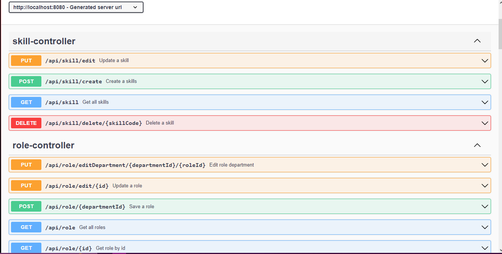
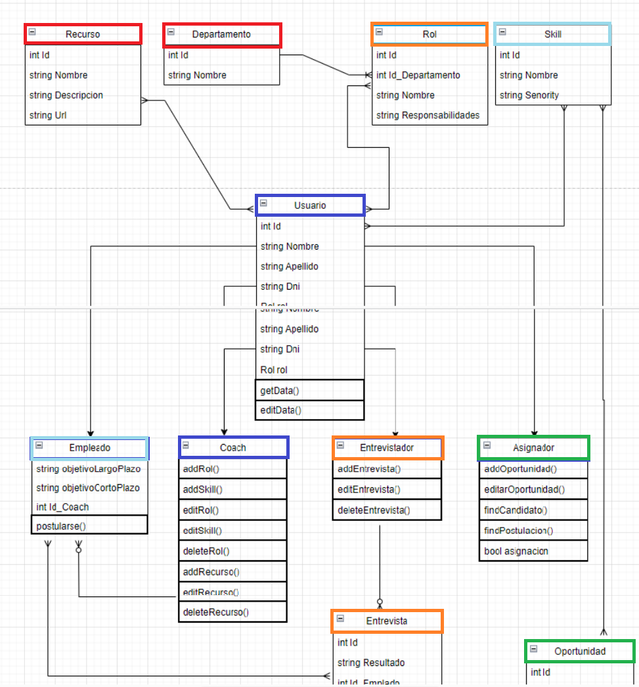

# API REST Springboot


## About
Este proyecto fue realizado en grupo como parte de un proceso formativo en ITR. 11 participantes de la capacitación armamos casos de uso, diagramamos las funcionalidades y repartimos tareas para cubrir un hipotético requerimiento para una aplicación institucional que permita a recluiters, asignadores, coaches y otros participantes de la organización poder administrar a los empleados, capacitaciones que realizan, ofertas internas a la que pueden postular entre otras funcionalidades. 
Fue realizada en un lapso de 3 semanas

## Run
Este proyecto fue hecho en Intellij Idea Community. Para un correcto acceso, se recomienda utilizar este IDE para poner en marcha el servidor
```bash
  exec EmployeeAplication on your IDE
```
## Screenshot


## Swagger
Esta API fue documentada con Swagger. Puedes ver los endpoints con el servidor en funcionamiento e ingresando a: 
https://localhost:8080/swagger-ui.html


## Status
Proyecto finalizado con capacidad de mejora

## Docs
**Este proyecto cuenta con historias de usuario, informes de seguimiento funcional, informes de revisión de código y logs que se ejecutan cada vez que se inicializa el servidor**


